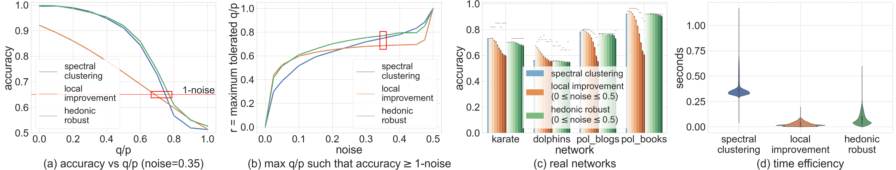
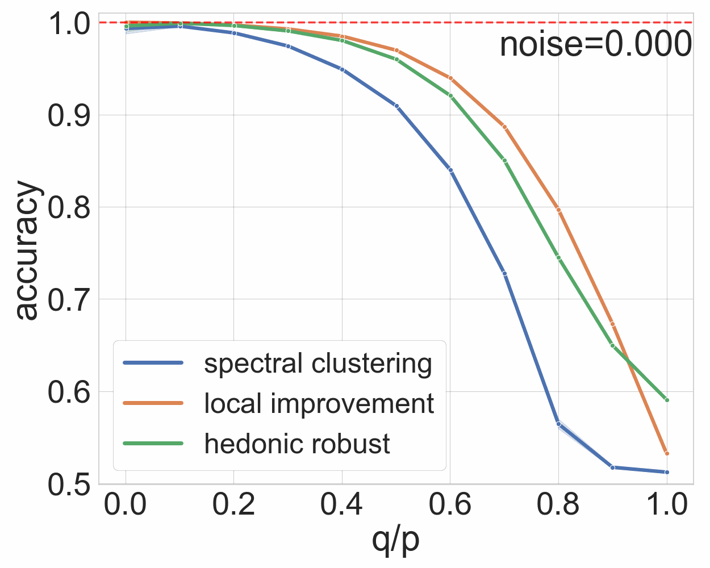

# Hedonic Games
> Submission for [WAIN workshop](https://www.performance2020.deib.polimi.it/wain-3/)

## To read the full paper (with appendix)

1. Go to: https://lucaslopes.github.io/test/paper.pdf

## To run experiments

1. Run the python file: `$ python run_experiments.py`

If you want to change experiment parameters, change it at the end of the file.

## To visualize results

1. Run the python file: `$ python fig1_plot.py`

It will generate:

1. Figure 1 

2. Fig 1 (a) but for all noises (saved in `./outputs/noises/plots/`)

3. A GIF with all plots of Fig 1 (a) (all noises)

