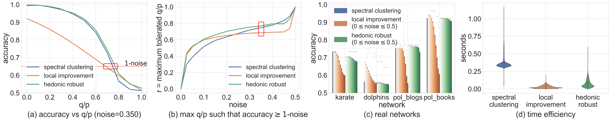

# Hedonic Games
> Community detection using game theory and alternative approaches

## Full paper (technical report)

Available at: https://lucaslopes.github.io/hedonic/paper.pdf

## To run experiments

1. Run the python file: `$ python run_experiments.py`

If you want to change experiment parameters, change it at the end of the file.

## To visualize results

1. Run the python file: `$ python fig1_plot.py`

It will generate:

1. [Figure 1](https://lucaslopes.github.io/hedonic/fig1.png)

<!--  -->

2. Fig 1 (a) is considered at multiple noise levels (saved in `./outputs/noises/plots/`)

3. An [animated gif](https://lucaslopes.github.io/hedonic/noises.gif) accounting for all noise levels is shown below

<!--  -->
