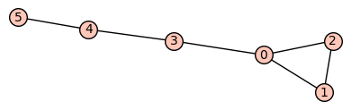
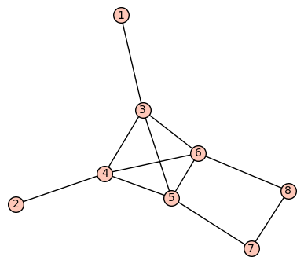
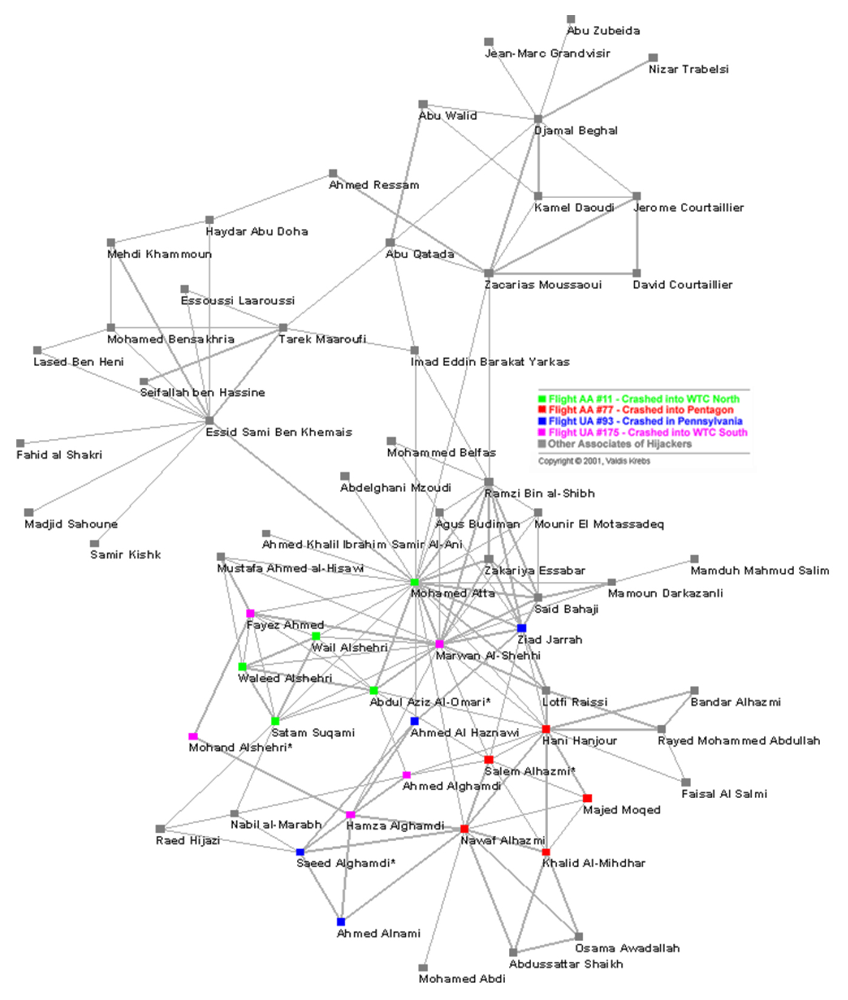
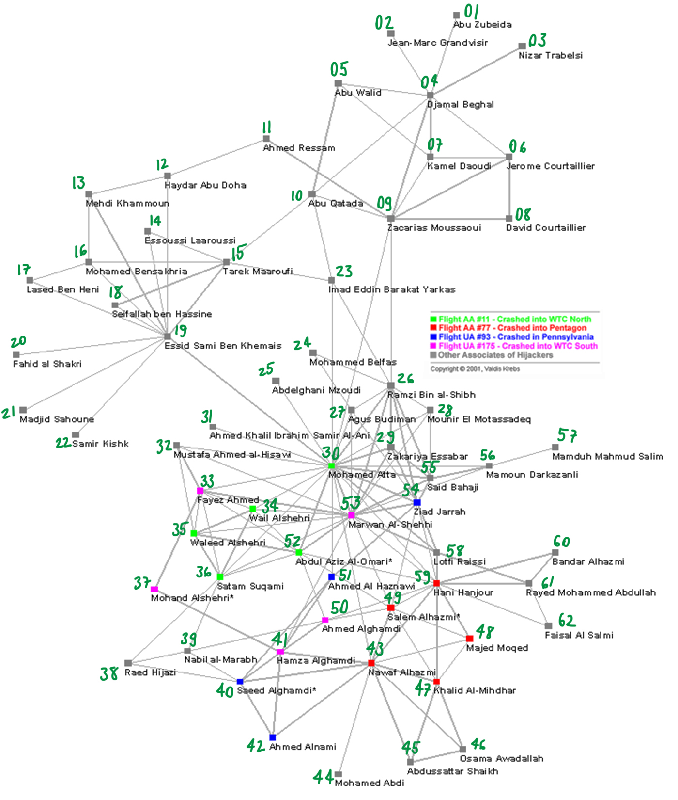

# Network Graphs (Datasets)

## Sample Graphs
> Simple Network Graphs

There are 2 graphs:

1. Sample **1**

2. Sample **2**

<!--------------------------------------------------------------->

## Terrorist Network
> From this [paper](https://journals.uic.edu/ojs/index.php/fm/rt/printerFriendly/941/863)

Network from [Figure 4](https://journals.uic.edu/ojs/index.php/fm/rt/printerFriendly/941/863#fig4):

And its representation with numbers:
_(the .csv file is in numeric representation)_

As well in table format for better readability:

| Number | Name                              |
|--------|-----------------------------------|
| 01     | Abu Zubeida                       |
| 02     | Jean-Marc Grandvisir              |
| 03     | Nizar Trabelsi                    |
| 04     | Djamal Beghal                     |
| 05     | Abu Walid                         |
| 06     | Jerome Courtaillier               |
| 07     | Kamel Daoudi                      |
| 08     | David Courtaillier                |
| 09     | Zacarias Moussaoui                |
| 10     | Abu Qatada                        |
| 11     | Ahmed Ressam                      |
| 12     | Haydar Aby Doha                   |
| 13     | Mehdi Khammoun                    |
| 14     | Essoussi Laaroussi                |
| 15     | Tarek Maaroufi                    |
| 16     | Mohamed Bensakhria                |
| 17     | Tased Ben Heni                    |
| 18     | Seifallah Ben Hassine             |
| 19     | Essid Sami Ben Khemais            |
| 20     | Fahid al Shakri                   |
| 21     | Madjid Sahoune                    |
| 22     | Samir Kishk                       |
| 23     | Imad Eddin Barakat Yarkas         |
| 24     | Mohammed Belfas                   |
| 25     | Abdelghani Mzoudi                 |
| 26     | Ramzi Bin al-Shibh                |
| 27     | Agus Budiman                      |
| 28     | Mounir El Motassadeq              |
| 29     | Zakariya Essabar                  |
| 30     | Mohamed Atta                      |
| 31     | Ahmed Khalil Ibrahim Samir Al-Ani |
| 32     | Mustafa Ahmed al-Hisawi           |
| 33     | Fayez Ahmed                       |
| 34     | Wail Alshehri                     |
| 35     | Waleed Alshehri                   |
| 36     | Satam Suqami                      |
| 37     | Mohand Alshehri                   |
| 38     | Raed Hijazi                       |
| 39     | Nabil al-Marabh                   |
| 40     | Saeed Alghamdi                    |
| 41     | Hamza Alghamdi                    |
| 42     | Ahmed Alnami                      |
| 43     | Nawaf Alhazmi                     |
| 44     | Mohamed Abdi                      |
| 45     | Abdussattar Shaikh                |
| 46     | Osama Awadallah                   |
| 47     | Khalid Al-Mihdhar                 |
| 48     | Majed Moqed                       |
| 49     | Salem Alhazmi                     |
| 50     | Ahmed Alghamdi                    |
| 51     | Ahmed Al Haznawi                  |
| 52     | Abdul Aziz Al-Omari               |
| 53     | Marwan Al-Shehhi                  |
| 54     | Ziad Jarrah                       |
| 55     | Said Bahaji                       |
| 56     | Mamoun Darkazanli                 |
| 57     | Mamduh Mahmud Salim               |
| 58     | Lotfi Raissi                      |
| 59     | Hani Hanjour                      |
| 60     | Bandar Alhazmi                    |
| 61     | Rayed Mohammed Abdullah           |
| 62     | Faisal Al Salmi                   |

<!--------------------------------------------------------------->

## Conference Dataset
> From this [paper](https://arxiv.org/abs/1205.6233)

[DBLP collaboration network and ground-truth communities.](http://snap.stanford.edu/data/com-DBLP.html)

| File                         | Description                           |
|------------------------------|---------------------------------------|
| com-dblp.ungraph.txt.gz      | Undirected DBLP co-authorship network |
| com-dblp.all.cmty.txt.gz     | DBLP communities                      |
| com-dblp.top5000.cmty.txt.gz | DBLP communities (Top 5,000)          |
| conference.csv               | Network as CSV                        |
| conference-crop.csv          | A Sample from the Network             |
